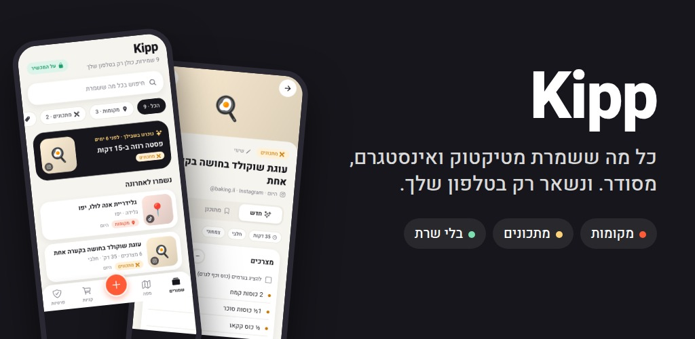
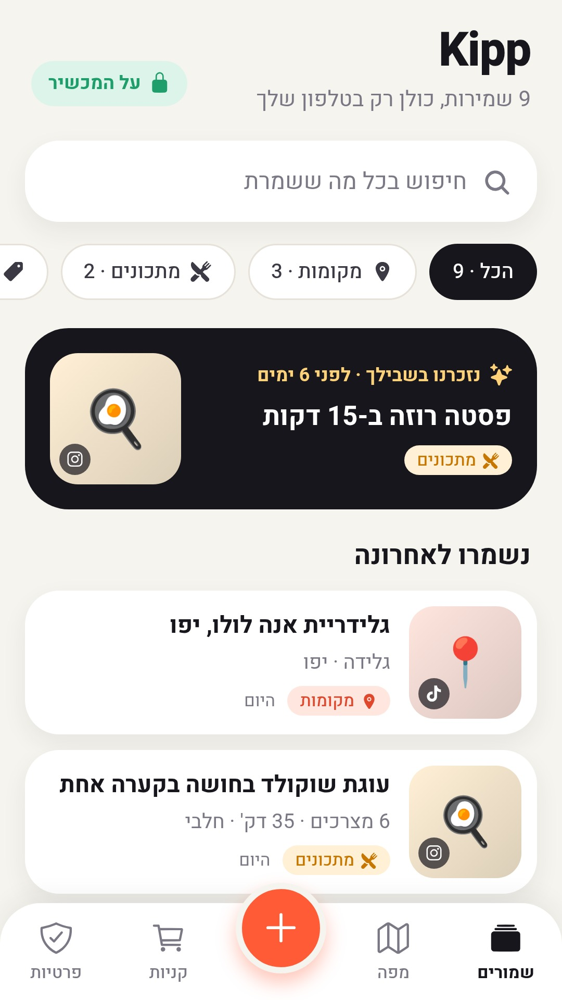
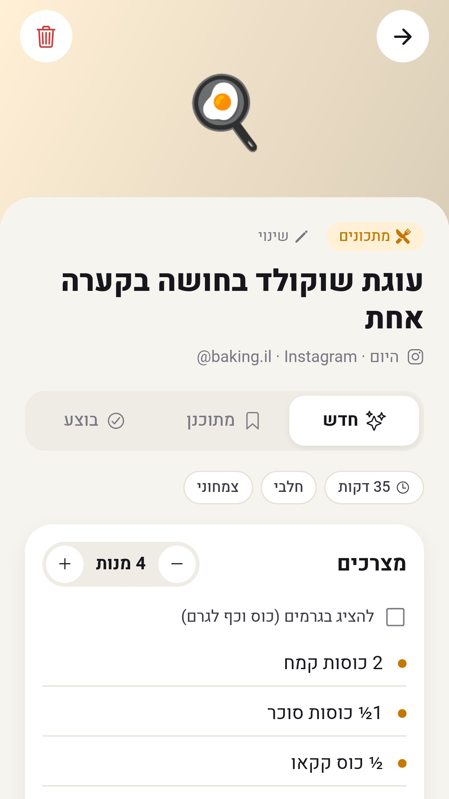
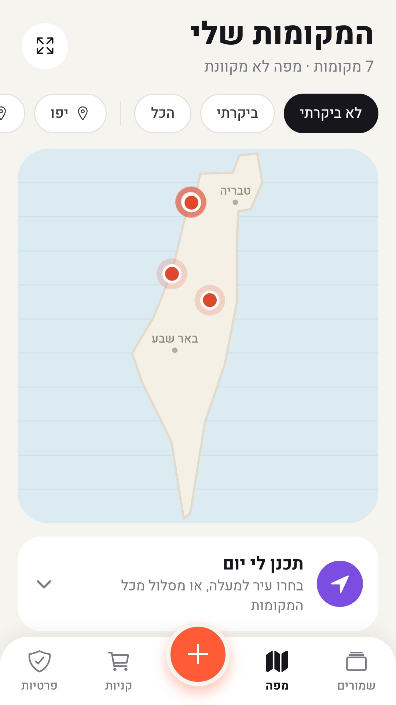
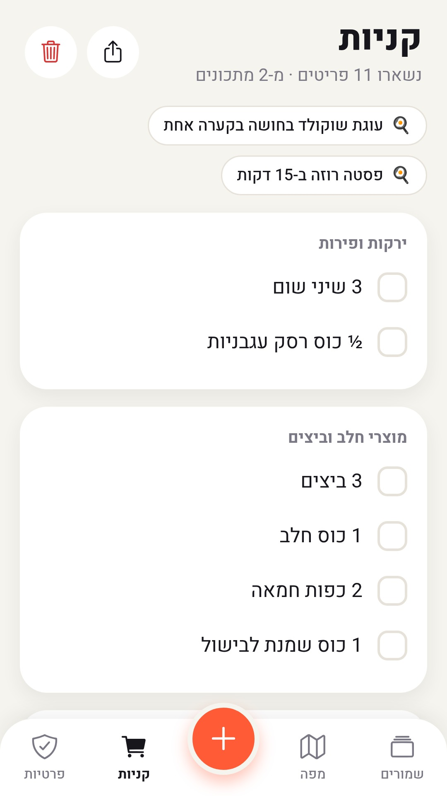
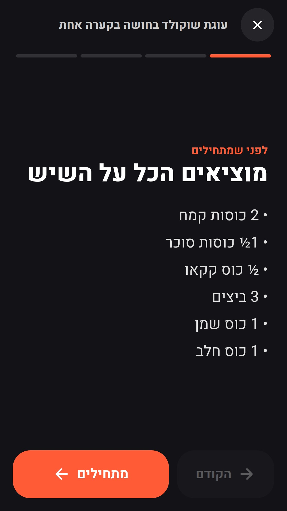
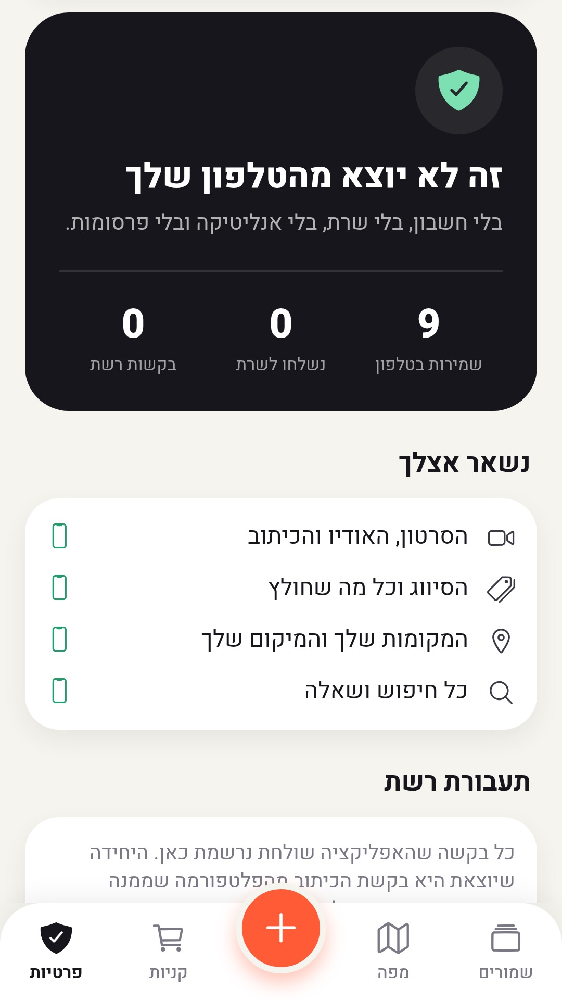

<div dir="rtl">

# Kipp · חומרים לדף האפליקציה ב-Google Play

מורידים כל קובץ מהקישור ומעלים ב-Play Console ← **Grow users** ← **Store presence** ← **Main store listing**.

## גרפיקה

| שדה בקונסול | קובץ | גודל |
|---|---|---|
| App icon | [icon-512.png](https://raw.githubusercontent.com/s137251-coder/kipp-privacy/main/store/icon-512.png) | 512×512 PNG |
| Feature graphic | [feature-graphic-1024x500.jpg](https://raw.githubusercontent.com/s137251-coder/kipp-privacy/main/store/feature-graphic-1024x500.jpg) | 1024×500 JPG |
| Phone screenshots (1) | [screenshot-1-home.jpg](https://raw.githubusercontent.com/s137251-coder/kipp-privacy/main/store/screenshot-1-home.jpg) | 1080×1920 |
| Phone screenshots (2) | [screenshot-2-recipe.jpg](https://raw.githubusercontent.com/s137251-coder/kipp-privacy/main/store/screenshot-2-recipe.jpg) | 1080×1920 |
| Phone screenshots (3) | [screenshot-3-map.jpg](https://raw.githubusercontent.com/s137251-coder/kipp-privacy/main/store/screenshot-3-map.jpg) | 1080×1920 |
| Phone screenshots (4) | [screenshot-4-shopping.jpg](https://raw.githubusercontent.com/s137251-coder/kipp-privacy/main/store/screenshot-4-shopping.jpg) | 1080×1920 |
| Phone screenshots (5) | [screenshot-5-cook.jpg](https://raw.githubusercontent.com/s137251-coder/kipp-privacy/main/store/screenshot-5-cook.jpg) | 1080×1920 |
| Phone screenshots (6) | [screenshot-6-privacy.jpg](https://raw.githubusercontent.com/s137251-coder/kipp-privacy/main/store/screenshot-6-privacy.jpg) | 1080×1920 |



     

## טקסטים (עברית, שפת ברירת המחדל)

**App name** (עד 30 תווים):
```
Kipp
```

**Short description** (עד 80 תווים):
```
כל מה ששמרת מטיקטוק ואינסטגרם, מסודר. בלי שרת, הכל נשאר בטלפון.
```

**Full description** (עד 4000 תווים):
```
שמרתם מתכון בטיקטוק, מסעדה באינסטגרם וטיפ ביוטיוב, ואז לא מצאתם אותם כשצריך? Kipp מסדרת הכל לבד.

משתפים ל-Kipp סרטון או פוסט, והוא נשמר ומסודר תוך שנייה:
📍 מקומות: מסעדות, בתי קפה ומסלולים, על מפה של ישראל
🍳 מתכונים: מצרכים, זמן הכנה, הגדלה או הקטנה של מנות
🛍️ מוצרים וקופונים: מחיר, קוד הנחה ותאריך תפוגה
💡 טיפים, אימונים, יעדי טיול ועוד

🔒 פרטיות אמיתית
כל העיבוד קורה בטלפון שלכם. אין חשבון, אין שרת, אין אנליטיקה ואין פרסומות. במסך "פרטיות" רואים כל בקשת רשת שהאפליקציה שולחת.

✨ Kipp Pro, תשלום אחד, בלי מנוי
• שמירות ללא הגבלה (בחינם: עד 100)
• רשימת קניות חכמה: מצרכים מכמה מתכונים מתאחדים לפי מחלקות בסופר
• מצב בישול: שלב אחרי שלב, המסך לא נכבה
• נעילה בטביעת אצבע
• שחזור מגיבוי לטלפון חדש, בלי שרת
```

## English (optional translation)

**Short description:**
```
Everything you saved from TikTok and Instagram, organized. All on your phone.
```

**Full description:**
```
Saved a recipe on TikTok, a restaurant on Instagram and a tip on YouTube, then couldn't find them when you needed them? Kipp organizes it all for you.

Share a video or post to Kipp and it's saved and sorted in a second:
📍 Places: restaurants, cafés and trails, on a map
🍳 Recipes: ingredients, cooking time, scale servings up or down
🛍️ Products and coupons: price, discount code and expiry date
💡 Tips, workouts, trips and more

🔒 Real privacy
Everything is processed on your phone. No account, no server, no analytics and no ads. The Privacy screen lists every network request the app makes.

✨ Kipp Pro, pay once, no subscription
• Unlimited saves (free: up to 100)
• Smart shopping list: ingredients from several recipes merged by supermarket aisle
• Cooking mode: step by step, the screen stays on
• Fingerprint lock
• Restore from a backup on a new phone, no server
```

## הגדרות נוספות בדף החנות

| שדה | ערך |
|---|---|
| App category | Productivity |
| Tags | Productivity, Food & drink, Travel |
| Contact email | s137251.gs@gmail.com |
| Privacy policy | https://github.com/s137251-coder/kipp-privacy |

</div>
